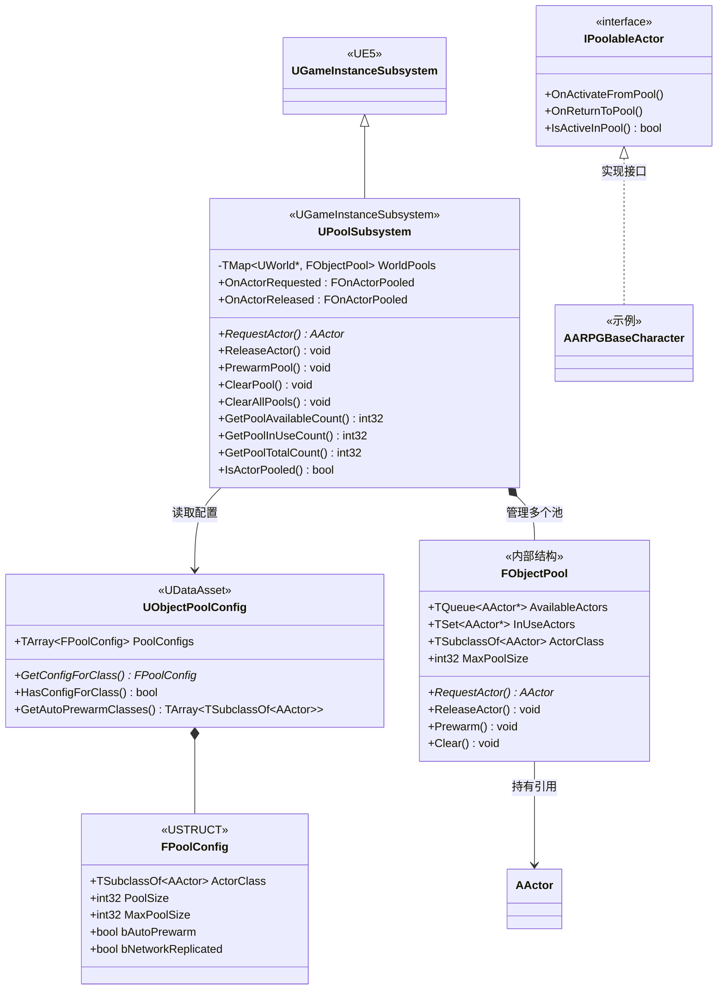
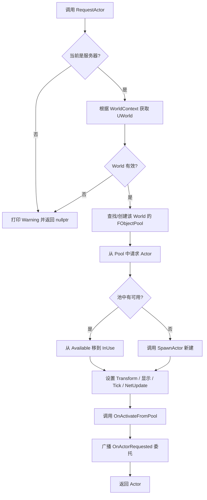
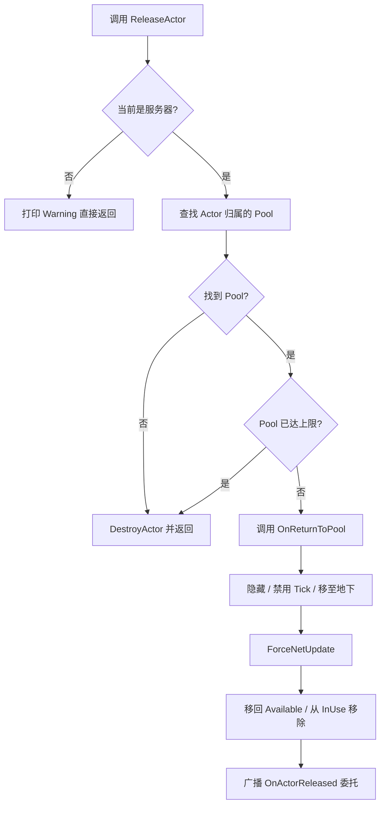
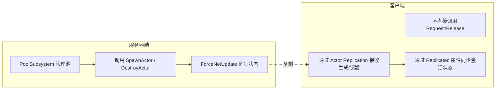

# ARPG 对象池系统架构文档

## 1. 概述

本对象池系统用于管理游戏中频繁生成/销毁的 Actor（如子弹、敌人、特效等），通过复用已存在的 Actor 实例来减少频繁的 `SpawnActor` / `DestroyActor` 带来的性能开销。

### 核心特性

- **GameInstance 生命周期**：`PoolSubsystem` 继承自 `UGameInstanceSubsystem`，跨关卡持续存在
- **按 World 隔离**：支持同时存在多个 World（如 PIE 多窗口、子关卡场景），各 World 的池互不干扰
- **网络同步支持**：仅在服务器端管理池，取出的 Actor 通过 UE 的复制机制自动同步到客户端
- **Blueprint 友好**：所有主要接口均为 `BlueprintCallable`
- **配置驱动**：通过 `ObjectPoolConfig` 数据资产集中管理池参数

---

## 2. 模块结构

```
Source/ARPG_Project/ARPGScripts/Gameplay/Base/ARPGObjectPoolSystem/
├── ObjectPoolConfig.h/.cpp      # 池配置数据资产
├── PoolableActor.h/.cpp         # 池化 Actor 接口
├── PoolSubsystem.h/.cpp         # 核心管理器 (GameInstanceSubsystem)
```

---

## 3. 类图



---

## 4. 核心类说明

### 4.1 UPoolSubsystem

继承自 `UGameInstanceSubsystem`，是对象池系统的唯一入口。

| 成员 | 说明 |
|---|---|
| `WorldPools` | `TMap<UWorld*, FObjectPool>`，按 World 隔离存储 |
| `RequestActor` | 从池中请求一个 Actor，无可用时新建 |
| `ReleaseActor` | 将 Actor 释放回池，不可回收时 Destroy |
| `PrewarmPool` | 预先创建指定数量的 Actor 实例 |
| `ClearPool` / `ClearAllPools` | 清空单个或全部 World 的池 |
| `OnActorRequested` / `OnActorReleased` | BlueprintAssignable 委托，供外部监听 |

### 4.2 IPoolableActor 接口

实现此接口的 Actor 可以在取出/回收时收到回调，用于重置状态。

| 方法 | 触发时机 |
|---|---|
| `OnActivateFromPool()` | 从池中取出并重新激活 |
| `OnReturnToPool()` | 释放回池时调用 |
| `IsActiveInPool()` | 查询当前是否处于活跃状态 |

### 4.3 UObjectPoolConfig

集中管理所有池的配置参数，支持按类独立设置。

| 字段 | 说明 |
|---|---|
| `PoolSize` | 初始池容量 |
| `MaxPoolSize` | 池上限（超过则直接 Destroy） |
| `bAutoPrewarm` | 是否在 Subsystem 初始化时自动预热 |
| `bNetworkReplicated` | 该池的 Actor 是否参与网络复制 |

---

## 5. 时序图

### 5.1 请求 Actor（池中有可用）

```mermaid
sequenceDiagram
    autonumber
    participant BP as Blueprint/C++
    participant PS as UPoolSubsystem
    participant Pool as FObjectPool
    participant Actor as APoolableActor

    BP->>PS: RequestActor(Class, Transform)
    PS->>PS: 检查服务器权限
    PS->>PS: 获取/创建目标 World 的 Pool
    PS->>Pool: RequestActor()
    Pool->>Pool: AvailableActors.Pop(Actor)
    Pool->>Pool: InUseActors.Add(Actor)
    Pool-->>PS: return Actor
    PS->>Actor: SetActorTransform(Transform)
    PS->>Actor: SetActorHiddenInGame(false)
    PS->>Actor: SetActorTickEnabled(true)
    PS->>Actor: ForceNetUpdate()
    PS->>Actor: OnActivateFromPool()
    PS->>PS: Broadcast OnActorRequested
    PS-->>BP: return Actor
```

### 5.2 请求 Actor（池为空，需要新建）

```mermaid
sequenceDiagram
    autonumber
    participant BP as Blueprint/C++
    participant PS as UPoolSubsystem
    participant Pool as FObjectPool
    participant World as UWorld
    participant Actor as APoolableActor

    BP->>PS: RequestActor(Class, Transform)
    PS->>PS: 检查服务器权限
    PS->>PS: 获取/创建目标 World 的 Pool
    PS->>Pool: RequestActor()
    Pool->>Pool: AvailableActors 为空
    Pool->>World: SpawnActor(Class)
    World-->>Pool: return NewActor
    Pool->>Pool: InUseActors.Add(NewActor)
    Pool-->>PS: return NewActor
    PS->>Actor: SetActorTransform(Transform)
    PS->>Actor: SetActorHiddenInGame(false)
    PS->>Actor: SetActorTickEnabled(true)
    PS->>Actor: ForceNetUpdate()
    PS->>Actor: OnActivateFromPool()
    PS->>PS: Broadcast OnActorRequested
    PS-->>BP: return NewActor
```

### 5.3 释放 Actor 回池

```mermaid
sequenceDiagram
    autonumber
    participant BP as Blueprint/C++
    participant PS as UPoolSubsystem
    participant Pool as FObjectPool
    participant Actor as APoolableActor

    BP->>PS: ReleaseActor(Actor)
    PS->>PS: 检查服务器权限
    PS->>PS: 查找 Actor 归属的 Pool
    alt 找到 Pool 且未达上限
        PS->>Actor: OnReturnToPool()
        PS->>Actor: SetActorHiddenInGame(true)
        PS->>Actor: SetActorTickEnabled(false)
        PS->>Actor: SetActorLocation(0,0,-10000)
        PS->>Actor: ForceNetUpdate()
        PS->>Pool: AvailableActors.Push(Actor)
        PS->>Pool: InUseActors.Remove(Actor)
        PS->>PS: Broadcast OnActorReleased
    else 未找到 Pool 或已达上限
        PS->>World: DestroyActor(Actor)
    end
```

### 5.4 World 切换 / 销毁时的清理

```mermaid
sequenceDiagram
    autonumber
    participant UE as UE 引擎
    participant PS as UPoolSubsystem
    participant Pool as FObjectPool
    participant Actor as APoolableActor

    UE->>UE: World 销毁
    UE->>PS: OnWorldCleanup(World)
    PS->>PS: 查找 WorldPools[World]
    PS->>Pool: Clear()
    loop 遍历所有 Actor
        Pool->>Actor: DestroyActor()
    end
    PS->>PS: WorldPools.Remove(World)
```

---

## 6. 流程图

### 6.1 RequestActor 整体流程



### 6.2 ReleaseActor 整体流程



### 6.3 网络同步策略



---

## 7. 生命周期管理

### 7.1 PoolSubsystem 生命周期

```
GameInstance 创建
    |
    v
PoolSubsystem::Initialize()
    |
    v
绑定 OnWorldCleanup 委托
    |
    v
[关卡切换] ---> 不影响 Subsystem（GameInstance 级别）
    |
    v
[World 销毁] ---> OnWorldCleanup ---> 清理对应 WorldPools
    |
    v
GameInstance 销毁
    |
    v
PoolSubsystem::Deinitialize() ---> 清理所有 WorldPools
```

### 7.2 单个 Actor 在池中的生命周期

```
[SpawnActor 创建]
    |
    v
[放入 Available 队列]  <--->  [被 Request 取出]
    |                               |
    |                               v
    |                         [放入 InUse 集合]
    |                               |
    |                               v
    |                         [OnActivateFromPool]
    |                               |
    |                               v
    |                         [Release 释放回池]
    |                               |
    +-------------------------------+
    |
    v
[World 清理 / Pool 超上限]
    |
    v
[DestroyActor]
```

---

## 8. 设计决策

| 决策 | 说明 |
|---|---|
| 为何用 GameInstanceSubsystem 而非 WorldSubsystem | 跨关卡保持池的预热状态，避免每次切关重新预热 |
| 为何仅服务器管理池 | UE 的网络模型中，服务器是权威端，SpawnActor 只能在服务器执行 |
| FObjectPool 为何用 TQueue + TSet | `TQueue` 保证 O(1) 取出可用，`TSet` 保证 O(1) 查询是否在使用中 |
| ReleaseActor 时找不到 Pool 直接 Destroy | 防御性设计，防止内存泄漏，宁可销毁也不悬空 |
| ForceNetUpdate 的作用 | 确保池化 Actor 的隐藏/显示状态立即同步到客户端，而不是等下一个复制窗口 |
